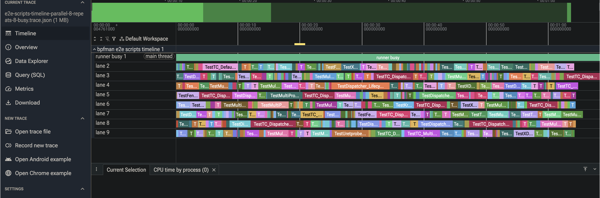

# go-test-timeline

Turn a `go test` JSON event stream into a Chrome Trace Event JSON file
you can open in `chrome://tracing` or
[ui.perfetto.dev](https://ui.perfetto.dev), and see your tests laid out
on a time axis: which ran when, which overlapped, and where the runner
sat idle.

It is a development tool, deliberately kept out of the production
bpfman binary set. Its main use here is answering "is the test harness
actually parallelising, and if not, where are the stalls?".



## Input and output

Input is the JSON event stream from either:

- `go test -json ...`, or
- `go tool test2json -t ...` (the `-t` is required -- without it
  test2json omits timestamps, and every event must carry a `Time`).

Each line is one event with `Time`, `Action`, `Package`, `Test`, and
`Elapsed`. Events with no `Test` (package-level lines) are ignored. If
an event has a zero `Time` the tool stops with an error telling you to
use one of the two forms above.

Output is Chrome Trace Event JSON (`displayTimeUnit: ms`), written to
stdout or `-output`.

## Running it

Through the Makefile (the normal path):

- `make test-timeline` -- runs the unit tests with `-json` and renders
  the trace under the coverage directory.
- `make test-e2e-scripts-timeline` -- runs the `.bpfman` e2e corpus
  (requires root), emits exact per-script markers, and renders a trace
  with one bar per script.

By hand:

```
go test -json ./... | go-test-timeline -output trace.json
# then load trace.json in https://ui.perfetto.dev
```

## Flags

- `-input` (default `-`): go test JSON input path, or `-` for stdin.
- `-output` (default `-`): Chrome trace JSON output path, or `-` for
  stdout.
- `-markers`: optional JSONL file of exact `script_start` / `script_end`
  timing markers (see below).
- `-title` (default `Go test timeline`): the trace's process name.
- `-test-name-match`: render only rows whose full `package/test` name
  contains this substring.

## How it reads the stream

Events are grouped into one row per `package + test`. Within a row the
`Action` field drives a small state machine that records intervals: a
`run` opens a `running` slice, `pause` closes it and opens a `paused`
slice, `cont` closes the pause and reopens `running`, and a terminal
`pass` / `fail` / `skip` closes the current slice and stamps the row's
outcome. Any slice still open at end of stream is closed at the last
observed time.

Two details are worth knowing because they are not obvious from the raw
stream:

**Parallel-subtest end times are corrected.** test2json timestamps a
terminal action when the `--- PASS/FAIL/SKIP` line is printed, and for
parallel subtests the parent prints those summaries only after every
child has finished -- so the printed timestamp can land well after the
test actually ended. When a row's `Elapsed` is available it is treated
as authoritative: the final running slice is closed at `start +
Elapsed` (capped at the event time) rather than at the print time. This
keeps overlapping subtests from all appearing to end at the same late
instant.

**Exact markers override the inferred timing.** With `-markers`, the
tool reads a second stream of `script_start` / `script_end` events
(emitted by the e2e script runner via `BPFMAN_E2E_SCRIPT_TIMELINE`).
For any test that has both, the row's intervals are replaced with a
single `running` slice spanning exactly start to end. This is what
gives the `.bpfman` corpus precise per-script wall-clock, where one Go
subtest wraps an entire script and the surrounding Go machinery would
otherwise blur the boundaries.

## How it lays out the trace

Only `running` intervals are placed (the brief registration slice a
test emits between `run` and `pause` at `t.Parallel()` is dropped so it
does not clutter the view). Intervals are sorted by start time and
greedily packed into lanes: each interval goes into the first lane
whose previous interval has already ended, opening a new lane only when
none is free. The number of lanes is therefore the peak concurrency --
the most tests that were ever running at once. Each lane becomes its
own track in the trace, and every bar carries args (`full_name`,
`package`, `elapsed`, `terminal`, `state`, `parallelLane`) and a
category (`running` / `paused` / `failed` / `skipped`) that drives its
colour.

Above the lanes is a derived **runner busy** track: the union of all
running intervals merged into maximal spans. Where that track is solid
the harness had at least one test in flight; the gaps are idle time.
Reading the lane count against the busy track is the quick way to see
whether work is actually running in parallel or just queued behind a
serial bottleneck.

All timestamps in the output are relative to the first event, in
microseconds.
